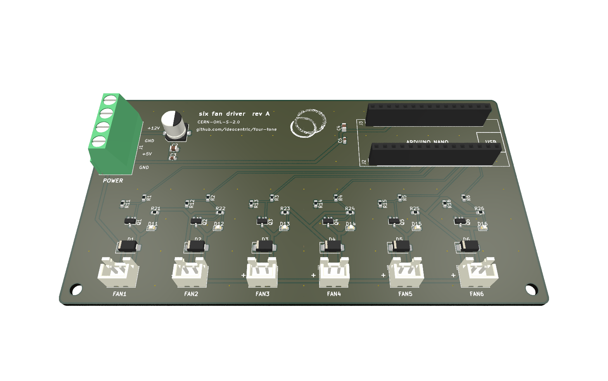
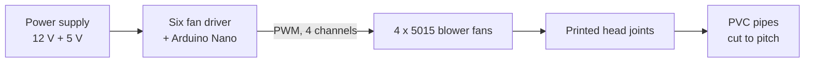

# four-tone

A four-note organ played by computer fans. An Arduino Nano runs a sequence
through four 12 V blower fans, and each fan blows into a 3D printed,
recorder-style head joint on a length of 2" PVC pipe. All four voices are identical
except for the pipe length, which sets the note.



## How it works



- **Firmware:** the Nano steps through 24 phrases (every ordering of the four
  pipes, then a rest) against 5 rhythms, at 50 BPM. Each note fades its fan up
  over 250 ms and back down after. The pattern takes 14.4 minutes to repeat.
- **Driver board:** a carrier for the Nano with six MOSFET fan channels, an
  indicator LED per channel, and a screw terminal for the supply. four-tone uses
  four channels.
- **Voices:** a 5015 blower in a printed caddy, hot glued into a printed head
  joint, on a 2" PVC pipe. The head joint holds the windway, window and labium,
  like the head joint of a contrabass recorder or the mouth of an organ flue pipe.

## Status

| Part | State |
| ---- | ----- |
| Head joint and fan caddy | Designed and printed; the head joint is tested with 2" PVC |
| Enclosure | Built: an open-bottom wooden box. Dimensions not yet documented |
| Driver board | Rev A designed and ordered from JLCPCB (2026-09-15) |
| Firmware | Builds for the Nano; not yet run on the rev A board |
| Pipes | Target notes and lengths not yet chosen |

## Documentation

| Guide | For |
| ----- | --- |
| [Build guide](docs/build.md) | Assembly, wiring, and step-by-step power-up checks |
| [Tuning guide](docs/tuning.md) | Finding pipe lengths for your notes, with a calculator |
| [Print sourcing](docs/print-sourcing.md) | Where to print the head joints: quotes, tariffs and landed cost |
| [Wooden head joint](docs/wood-head-joint.md) | A wooden version of the head joint, drawn for quoting out |
| [Firmware](firmware/README.md) | Building, uploading, how the sequence works, changing the music |
| [Driver board](hardware/pcb/README.md) | Schematic, BOM, circuit and layout notes |
| [Parts list](hardware/parts.md) | Everything to buy or make |
| [Mechanical](mechanical/README.md) | Head joint and caddy models, printing, enclosure |

## Repository layout

```
four-tone/
├── platformio.ini        Firmware build configuration
├── firmware/             Arduino firmware (PlatformIO, C++)
├── hardware/
│   ├── parts.md          Parts list
│   ├── pcb/              Six fan driver: KiCad project and fabrication files
│   ├── art/              Silkscreen logo source
│   └── datasheets/       Reference datasheets
├── mechanical/           FreeCAD models: head joint, fan caddy, wooden version
├── tools/                Tuning calculator; model and drawing generators
└── docs/                 Build and tuning guides, images
```

## License

Copyleft throughout: firmware and tools under GPL-3.0-or-later, the driver board
under CERN-OHL-S-2.0, and the mechanical design and documentation under
CC-BY-SA-4.0. See [LICENSE.md](LICENSE.md). Per-file details are in
[REUSE.toml](REUSE.toml).
