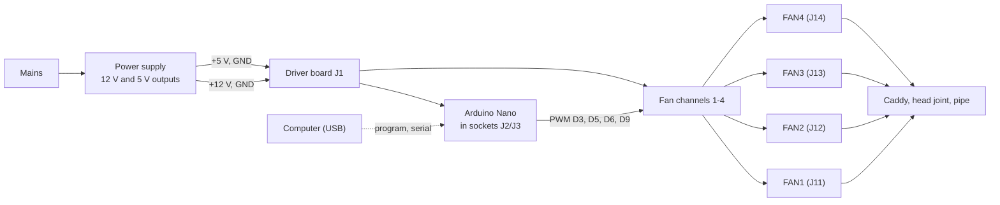
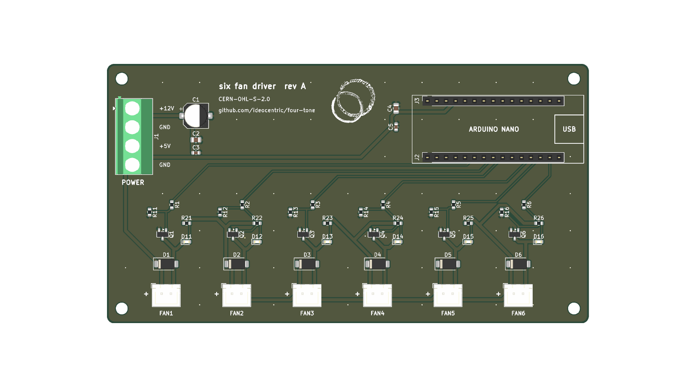

# Building four-tone

This guide takes you from parts to a playing instrument: making the voices,
wiring the electronics, and checking the driver board step by step before the fans
go on. The parts are listed in [`hardware/parts.md`](../hardware/parts.md).

> **Mains safety.** The power supply runs from mains voltage, and its input
> terminals are exposed. Make the mains connections with the supply unplugged,
> connect its earth terminal, set the 110/220 V input switch to your local supply
> before first power-up, and cover the terminals so they cannot be touched inside
> the enclosure. If you are not confident wiring mains, get help.

## Overview

## 1. Make the voices

For each of the four voices:

1. Print a head joint and a fan caddy (see [`mechanical/README.md`](../mechanical/README.md)).
2. Fit the fan into the caddy.
3. Seat the caddy's nozzle in the head joint's airway inlet and secure it with hot
   glue.
   Hot glue holds well and peels off, so a failed fan can be replaced.
4. Cut a pipe for the voice's note and push it into the head joint's socket. See the
   [tuning guide](tuning.md); cut long and trim later.

## 2. Check the driver board

Before connecting anything:

1. **Orientation:** on each diode D1-D6 and LED D11-D16, the cathode band should be
   at the closed end of the silkscreen outline. The 100 µF capacitor C1's positive
   side faces the + mark, toward the power terminal.
2. **No shorts:** with a meter on continuity or resistance, check there is no
   short between J1's +12 V and GND terminals, or between +5 V and GND.

## 3. Check the power supply

With the supply wired to mains but **not** connected to the board:

1. Power on and measure the 12 V and 5 V outputs.
2. Power off, unplug, and check with the meter that the 12 V output's ground and
   the 5 V output's ground are connected to each other. The board joins them, so
   they must already be common in the supply.

## 4. First power-up without the Nano or fans

1. Wire the supply to **J1**: pin 1 (top, marked +12V) to 12 V, pin 2 to ground,
   pin 3 (+5V) to 5 V, pin 4 to ground.
2. Power on. All six channel LEDs should stay **off**; the gate pull-downs hold the
   MOSFETs off while no Nano is fitted.
3. Measure the 5 V that the Nano will receive, on the top socket row (J3), counting
   from the end **away** from the USB marker: hole 4 is +5 V and hole 2 is GND.
4. Power off.

## 5. Fit the Nano and load the firmware

1. Plug the Nano into the sockets with its USB connector over the **USB** outline
   at the board edge.
2. Switch the supply **on**, then connect USB and upload the firmware (see
   [`firmware/README.md`](../firmware/README.md#building-and-uploading)). With
   the supply on, it powers the Nano through its 5V pin, and a genuine Nano's USB
   diode stops that feeding back into the computer (check a clone has one). With
   the supply off, the board would connect USB power to the supply's idle 5 V
   output, which loads the computer's port.
3. Once the upload finishes, LEDs 1-4 (D11-D14) should light and fade in turn as
   the sequence plays. Channels 5 and 6 stay dark; the firmware does not use them.
4. Optionally open the Serial Plotter at 9600 baud to watch the four fan levels.

## 6. Connect the fans

1. Check each fan's plug: the **red** lead must land on the pin beside the **+**
   mark (pin 1, +12 V). If it lands on the other pin, move the contacts in the
   housing before plugging in.
2. Power off. Plug in **one** fan, into FAN1, and power on. It should spin up when
   LED 1 lights and slow down after. Listen for ticking or stalling during the
   250 ms fade; brushless fans can react badly to PWM at low duty.
3. Power off and plug in the remaining fans: pipe 1 in FAN1, pipe 2 in FAN2, and
   so on.

## 7. Mount in the enclosure

The voices and the supply sit in an open-bottom wooden box. Keep the board within
about 250 mm of each fan, since the fan leads are 11" long, and keep the Nano's USB
end reachable for reprogramming.

Enclosure dimensions and layout: TBD
(see [`mechanical/README.md`](../mechanical/README.md#enclosure)).

## Troubleshooting

| Symptom | Check |
| ------- | ----- |
| No LEDs at all after upload | 5 V at J3 hole 4; the Nano's power LED; that the firmware uploaded |
| An LED lights but its fan does not spin | Fan plug polarity (red to +); the plug fully seated |
| A fan never stops | Its MOSFET or gate resistor; with the Nano removed, every LED and fan should be off |
| Upload fails with `not in sync` | Old bootloader: use `pio run -e nano_old -t upload` |
| Pipe is silent or breathy | Leaks around the caddy glue or the pipe socket; nozzle fully seated in the airway inlet |
| Pipe jumps an octave | Overblowing: too much air pressure for that pipe. Shorter, higher pipes overblow more easily |
