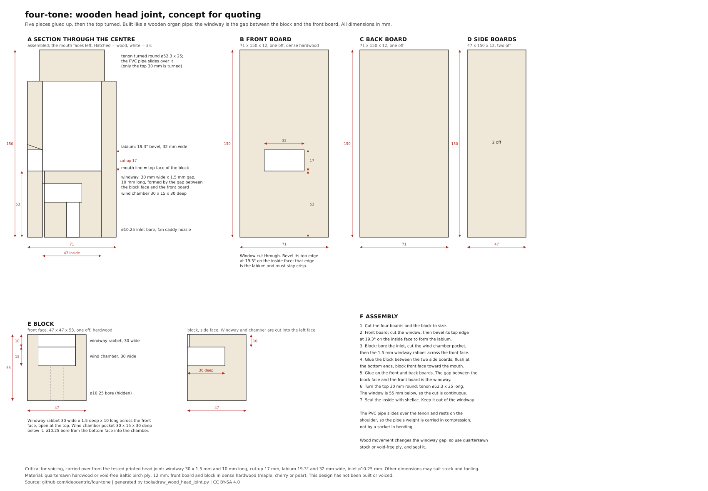

# Wooden head joint: design and quote package

A wooden version of the head joint, drawn and modelled so it can be sent out for
quotes. It is built the way a wooden organ pipe is: four boards and a block glued
into a square tube, with the windway formed as the **gap between the block face
and the front board** rather than as a slot cut into one piece. A separately
turned collar on top carries the spigot that the 2" PVC pipe slides over.

**This design has not been built or voiced.** The voicing dimensions are carried
over from the printed head joint (rev 02) that does work, but wood behaves
differently and a maker will adjust by ear.

## Why six pieces, not five

A tenon cannot be turned on the glued-up box. At ø52.3 mm the cut would break
through the corners of the 47 mm square interior and leave four disconnected arcs
instead of a ring. Turning a separate collar solves it, and it also moves all the
lathe work onto one small piece instead of the finished assembly.

## Cut list

| Piece | Size (mm) | Qty | Material |
| ----- | --------- | --- | -------- |
| Front board | 71 x 125 x 12, window 32 x 17 cut through, top edge bevelled 19.3° | 1 | Dense hardwood (maple, cherry, pear) |
| Back board | 71 x 125 x 12 | 1 | Hardwood or void-free Baltic birch ply |
| Side boards | 47 x 125 x 12 | 2 | Hardwood or void-free ply |
| Block | 47 x 47 x 53, with ø10.25 bore, wind chamber pocket and windway rabbet | 1 | Dense hardwood |
| Collar | 71 x 71 x 25, ø47 bore, with a ø52.3 x 25 spigot turned on the top face | 1 | Hardwood |

Assembled: 71 x 71 mm, 150 mm to the collar shoulder, 175 mm over the spigot.
For four voices, multiply by four; a fifth set is cheap while a shop is set up.

## Dimensions that matter

These decide whether the pipe speaks. Everything else can suit stock and tooling.

| Feature | Value | Suggested tolerance |
| ------- | ----- | ------------------- |
| Windway gap | 1.5 mm | ±0.1 mm, and parallel |
| Windway width | 30 mm | ±0.5 mm |
| Windway length | 10 mm | ±1 mm |
| Cut-up (windway exit to labium) | 17 mm | ±0.5 mm |
| Labium bevel | 19.3°, rising outward from the edge on the inside face | ±2°, edge crisp, not rounded |
| Window width | 32 mm | ±0.5 mm |
| Airway inlet bore | ø10.25 mm | +0.2/-0 mm, for the fan caddy nozzle |
| Spigot | ø52.3 x 25 mm | -0.1/+0 mm, to slide into 2" Sch 40 PVC (ID 52.5) |

Notes for whoever builds it:

- **Keep glue out of the windway.** Squeeze-out into a 1.5 mm gap ruins it. Wax
  the windway faces before glue-up, or apply glue sparingly away from the gap.
- **The labium edge must stay sharp.** It is the one feature that cannot be
  sanded round.
- **Seal the inside** with shellac, except the windway faces. Wood movement
  changes the gap, so quartersawn stock or void-free ply is worth the cost.
- **Grain direction:** the labium runs across the grain of the front board, so a
  dense, fine-grained species matters there most.
- **The spigot wall is 2.65 mm** between the ø47 bore and the ø52.3 outside. Turn
  it from a piece with the grain running across, not end grain.

## Files to send

| File | What it is |
| ---- | ---------- |
| [`images/wood-head-joint.svg`](images/wood-head-joint.svg) | The drawing: section, each piece, and the assembly sequence. Print it or convert to PDF |
| `../mechanical/wood/step/wood-head-joint-assembly.step` | The whole thing as 3D CAD, for a shop that works from models |
| `../mechanical/wood/step/*.step` | One STEP file per piece |
| `../mechanical/wood/dxf/*.dxf` | Flat profiles for sheet cutting, in mm: a CUT layer to cut through, and a REFERENCE layer showing what is machined afterwards |
| `../mechanical/wood/wood-head-joint.FCStd` | The FreeCAD model, if they want to change it |

The model is generated by `tools/model_wood_head_joint.py` from the dimensions in
`tools/wood_head_joint_spec.py`, the drawing by `tools/draw_wood_head_joint.py`
and the profiles by `tools/wood_dxf.py`. Edit the spec, re-run all three, and
everything stays consistent.

## Posting the job

For a fabrication network such as [100kGarages](https://100kgarages.com/job_board.php),
where fabricators bid on posted jobs:

> **Title:** Six-piece hardwood assembly, glued and turned: organ pipe head joint (4 off)
>
> **What:** Four boards and a block glued into a 71 x 71 x 125 mm square tube,
> plus a 71 x 71 x 25 mm collar with a ø52.3 x 25 mm spigot turned on it, glued
> on top. Drawing, STEP and DXF files attached. Quantity 4, plus 1 spare if it is
> cheap to add.
>
> **Material:** Quartersawn hardwood, or void-free Baltic birch ply for the back
> and sides. Front board, block and collar in a dense hardwood (maple, cherry or
> pear). Your choice of species; tell me what you have.
>
> **The critical features** are a 1.5 mm windway gap between two glued faces, a
> 19.3° bevel forming a crisp edge (the labium), a ø10.25 mm bore, and the ø52.3
> spigot. Glue must not enter the 1.5 mm gap. Everything else is ordinary joinery.
>
> **Deliverable:** Glued-up assemblies with the collar fitted, unfinished. I will
> seal and voice them.
>
> **Questions I need answered in the quote:** price for 4 and for 5, lead time,
> species offered, and whether you can hold the windway gap to ±0.1 mm.

## The specialist alternative

Organ pipe makers build wooden flue pipes to order and already solve every part
of this:

- **[Organ Supply Industries](https://www.organsupply.com/product-catalog/pipes-and-supplies/)**
  (Erie, PA): wood pipes in clear poplar with hardwood windways and caps, in most
  species, to custom scales, and voiced to your instructions.
- **[A.R. Schopp's Sons](https://www.arschopp.com/products/woodshop/)**
  (Alliance, OH): pipes and custom woodshop work, made to order.

Ask them for a **pipe mouth section**, or complete wooden pipes, with:

- The voicing dimensions in the table above, or simply the note each pipe should
  speak so they scale it themselves.
- A ø10.25 mm wind inlet at the foot, fed by a 12 V blower rather than a
  windchest.
- A spigot or socket to join 2" PVC, if the resonator stays PVC.

They normally supply organ builders, so ask whether they take an order of four.
Both are in the US, so there are no tariffs.
